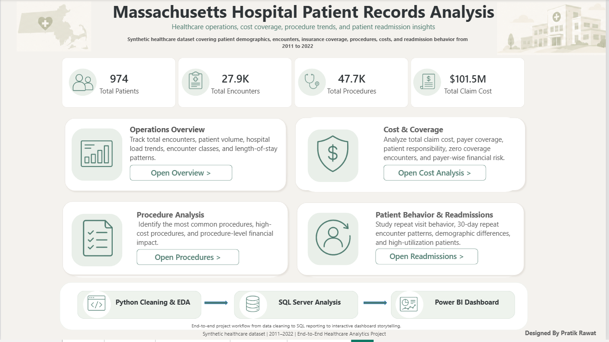
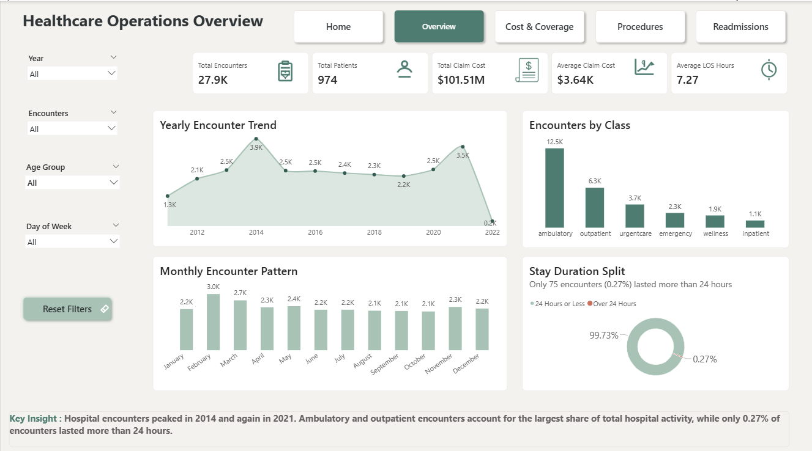
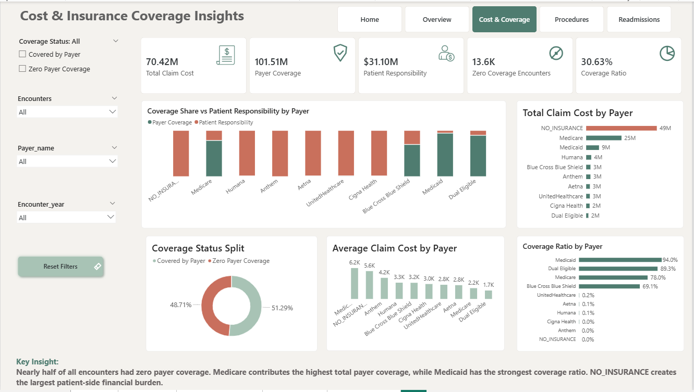

# end-to-end-healthcare-analytics-dashboard-python-sql-powerbi
# 🏥 End-to-End Healthcare Analytics Dashboard

## 📌 Project Overview

This is an end-to-end healthcare analytics project based on synthetic patient records from Massachusetts General Hospital.

The dataset contains information on approximately 1,000 patients from 2011 to 2022, including patient demographics, insurance coverage, medical encounters, procedures, claim costs, payer coverage, and repeat visit behavior.

The objective of this project is to simulate a real-world healthcare analytics workflow where raw patient records are first profiled in Excel, cleaned and explored using Python, analyzed using SQL Server, and finally visualized through an interactive Power BI dashboard.

---

## 🎯 Business Problem

Hospital management needs a clear analytical view of patient encounters, insurance coverage, procedure costs, and repeat visit behavior.

Without a structured dashboard, it becomes difficult to answer important questions such as:

- How are hospital encounters changing over time?
- Which encounter classes create the highest workload?
- How much of the claim cost is covered by payers?
- Which payers create the highest patient-side financial burden?
- Which procedures are most common and which generate the highest cost?
- Which patient groups show higher repeat visit behavior?
- Which patients contribute most to readmissions or repeat visits?

This project helps transform raw healthcare records into meaningful business insights for hospital operations, finance teams, insurance teams, and care management stakeholders.

---

## 🧾 Dataset Information

The dataset used in this project is a synthetic healthcare dataset based on hospital patient records.

It was sourced from **Maven Analytics Data Playground**.

🔗 **Dataset Source:** [Hospital Patient Records Dataset - Maven Analytics](https://mavenanalytics.io/data-playground/hospital-patient-records)

### Dataset Context

The dataset contains synthetic patient records for approximately **1,000 patients** from **Massachusetts General Hospital** between **2011 and 2022**.

It includes information related to:

- Patient demographics
- Insurance coverage
- Medical encounters
- Procedures
- Claim costs
- Payer coverage
- Patient out-of-pocket responsibility

### Dataset Size Used

| Metric | Value |
|---|---:|
| Total Patients | 974 |
| Total Encounters | 27,891 |
| Total Procedures | 47,701 |
| Time Period | 2011–2022 |
| Source | Maven Analytics Data Playground |
| Data Type | Synthetic Healthcare Dataset |

### Main Tables Used

- Patients
- Encounters
- Procedures
- Payers
- Organizations

The raw data was first profiled in Excel, cleaned and transformed using Python, imported into SQL Server for analysis, and finally visualized in Power BI.

---

## 🛠️ Tools & Technologies Used

| Tool | Purpose |
|---|---|
| Excel | Initial data profiling and basic exploration |
| Python | Data cleaning, transformation, feature engineering, and EDA |
| SQL Server | Data validation, business analysis queries, and reporting views |
| Power BI | Dashboard design, DAX measures, and visual storytelling |

---

## 🔄 Project Workflow

### 1. Excel: Data Profiling

Excel was used for the initial understanding of the dataset.

Tasks performed:

- Checked dataset structure
- Reviewed column names and data types
- Performed basic profiling
- Identified missing values and inconsistencies
- Created initial summaries before moving to Python

---

### 2. Python: Data Cleaning & EDA

Python was used to clean, transform, and explore the raw data.

Tasks performed:

- Loaded raw CSV files
- Checked missing values and duplicates
- Converted date columns into proper datetime format
- Created encounter year, month, month name, and year-month fields
- Calculated length of stay in hours and days
- Created patient out-of-pocket cost
- Created insurance coverage indicators
- Created readmission and 30-day repeat encounter flags
- Performed exploratory data analysis for encounters, costs, procedures, and patient behavior

---

### 3. SQL Server: Business Analysis

SQL Server was used to validate and analyze the cleaned data.

Tasks performed:

- Imported cleaned CSV files into SQL Server
- Validated table row counts
- Checked null values in key fields
- Wrote SQL queries for business questions
- Created reporting views for Power BI
- Used aggregations, joins, CTEs, and calculated fields

---

### 4. Power BI: Dashboard Development

Power BI was used to build a professional interactive dashboard.

Dashboard pages:

1. Home Page
2. Healthcare Operations Overview
3. Cost & Insurance Coverage Insights
4. Procedure Volume & Cost Analysis
5. Patient Behavior & Readmission Analysis

Power BI features used:

- KPI cards
- Slicers
- Page navigation buttons
- Donut charts
- Bar charts
- Line charts
- Treemap
- Matrix tables
- DAX measures
- Custom theme and layout
- Insight sections

---

## 📊 Dashboard Pages

## 🏠 1. Home Page

The Home Page introduces the project, dataset size, workflow, and navigation cards for all report sections.

---

## 📈 2. Healthcare Operations Overview

This page analyzes hospital workload and operational trends.

---

## 💳 3. Cost & Insurance Coverage Insights

This page focuses on payer coverage, claim cost, and patient financial responsibility.

---

## 🩺 4. Procedure Volume & Cost Analysis

This page analyzes procedure frequency and cost impact.

---

## 🔁 5. Patient Behavior & Readmission Analysis

This page analyzes repeat visit behavior and high-utilization patients.

--
## 🔍 Key Insights

1. Hospital encounters peaked in **2014** and again in **2021**, showing important workload changes over time.

2. **Ambulatory and outpatient encounters** formed the largest share of hospital activity.

3. Only **0.27% of encounters lasted more than 24 hours**, indicating that most visits were short-duration encounters.

4. Around **48.71% of encounters had zero payer coverage**, creating a major patient-side financial burden.

5. **NO_INSURANCE** generated the highest patient responsibility, while **Medicare** contributed the highest total payer coverage.

6. **Electrical Cardioversion** generated the highest total procedure cost, showing that procedure cost impact depends on both volume and cost.

7. The **65+ age group** had the highest 30-day repeat encounter rate, and a small group of high-utilization patients contributed heavily to repeat visits.
---

## 🔗 Live Dashboard

👉 **Power BI Live Dashboard:**  
[Click here to view the dashboard](https://app.powerbi.com/view?r=eyJrIjoiMWE1YzZkNzEtNjhhMy00NDRmLTk0NDUtMThlM2JmOTUyZjhkIiwidCI6ImVjMTU1NWRlLTlmMDAtNDQ1OS05MDA3LTUxNDc2NDQ3MDIwNyJ9)
